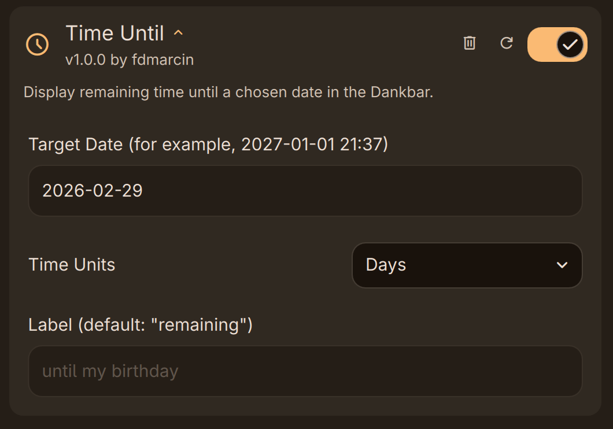
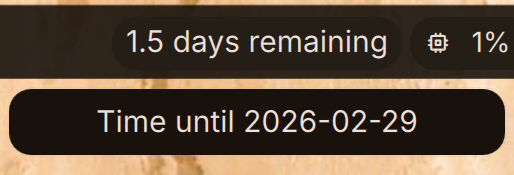
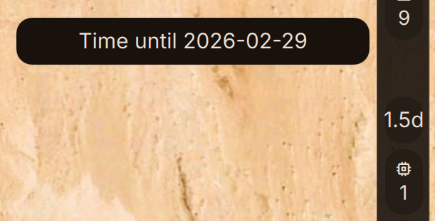

# Time Until

DankMaterialShell plugin that displays a customizable countdown timer in the Dank Bar.
Perfect for tracking important deadlines, goals, or any time-sensitive events.

Inspired by GNOME extension [No Time For Caution](https://github.com/ans-ibrahim/no-time-for-caution).

## Screenshots

| Settings | Horizontal | Vertical |
|---|---|---|
|  |  |  |

## Features

- Remaining time is displayed on the Dank Bar (horizontal).
- Remaining time is recalculated:
  - On shell start.
  - When changing settings.
  - When enough time passes for each unit to tick down by 0.1 or once a day, whichever is first.
- Time is shown with up to 1 decimal value.
- Time is calculated against your OS time.
- When the target date time passes, the widget shows the time overdue instead.

## Installation

1. Copy this directory to `~/.config/DankMaterialShell/plugins/`
1. Open **DMS Settings > Plugins**
1. Enable **Time Until**
   If it doesn't appear in the list, select **Scan** to detect it.
1. In DMS settings go to **Dank Bar > Widgets**.
1. Add **Time Until** to your Dank Bar widget list.

## Settings

To get to the plugin settings:

1. Open **DMS Settings > Plugins**.
1. Select the down chevron next to **Time Until**.

These settings are available:

- **Target Date** - Date to count down to, in the format `<YYYY>-<MM>-<DD> <hh>:<mm>`, for example `2026-04-10 21:37`.
  Time component is optional and defaults to midnight if omitted.
- **Unit** - Whether to use hours, days, weeks, or months. Default: days.
- **Label** - Text to show after the units. Default: "remaining". Changes to "overdue" when the target date is in the past.

## Usage

- **In the bar**: Observe time counting down to your set date (or up from it if overdue).
- **Click the widget**: See a popout with your target date.
